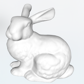

# Parallelize Mesh Simplification Algorithm with Pthread and OpenMP

- Bole Chen (bolec@andrew.cmu.edu)
- Haixin Liu (haixinl@andrew.cmu.edu)

## [Proposal](./index)

## Updated Schedule

## Works completed so far
- Designed and implemented a new mesh simplification algorithm to make it easy to parallelize.
- Discussed with professor Todd Mowry about how to parallelize this mesh simplification algorithm.
- Find potential parallel parts in the serial version algorithm, and parallized those parts with OpenMP and PThread.
- Designed the new parallel version algorithm. Trying to parallize our new mesh simplification algorithm in a multiple task queue model.

## Preliminary results

&emsp;&emsp;In this section, we show our benchmark on our new serial version algorithm. We show the running time, the percentage of the potential parallel parts in the serial algorithm and how many idpedendent tasks we can generate to parallize for the algorithm for models of different size and with different simplification ratio.

- Stanford Bunny: 35,292 vertices, 70,580 triangles

  | Ratio | Running time | Percentage of Parallel | Concurrent tasks number | picture                 |
  | :---: | :----------: | :--------------------: | :---------------------: | :---------------------: |
  | 0.9   | 0.812760s    | 59.2863%               | 7.417115                |  |
  | 0.5   | 3.792154s    | 62.8117%               | 7.233311                |  | 
  | 0.1   | 7.730236s    | 53.5701%               | 7.134595                |  |
  | 0.01  | 8.696549s    | 52.3328%               | 7.115745                |  |
  
  
- Stanford Dragon: 54,855 vertices, 109,227 triangles

  | Ratio | Running time | Percentage of Parallel | Concurrent tasks number | picture                  |
  | :---: | :----------: | :--------------------: | :---------------------: | :----------------------: |
  | 0.9   | 1.122375s    | 57.2763%               | 6.571914                |  |
  | 0.5   | 4.979142s    | 65.2532%               | 6.852200                |  |
  | 0.1   | 10.64453s    | 53.8220%               | 6.873644                |  |
  | 0.01  | 12.40377s    | 52.6605%               | 6.874545                |  |

- Stanford Lucy: 1,002,540 vertices, 2,005,076 triangles

  | Ratio | Running time | Percentage of Parallel | Concurrent tasks number | picture                |
  | :---: | :----------: | :--------------------: | :---------------------: | :--------------------: |
  | 0.2   | 227.477330s  | 48.4608%               | 7.060837                |  |
  | 0.1   | 277.754340s  | 44.7244%               | 7.050373                |  |
  | 0.01  | 319.221629s  | 45.2114%               | 7.039001                |  |
  | 0.001 | 331.384197s  | 43.2649%               | 7.037734                |  |
  

&emsp;&emsp;We can see from the experiments that when the size of model is large, it takes long time for the mesh simplification algorithm to complete. That's why we need parallelism to speedup it. Another thing to notice is that the potential parallel part in this algorithm is just about 50% and the concurrent task number is no more than 8. As a result, we must use another method to speedup. That is, divide the tasks evenly, and hopefully each process can do the tasks independently. We will discuss about the parallism algorithm in the following sections.

## Current Issues

## First try to parallelism

&emsp;&emsp; Our first try to parallelize the problem is to identify the independent loops within the serial algorithm. These loops can be distributed to many workers in a shared address space fashion. Common implementations include OpenMp and Pthread library. We implemented this parallel algorithm in both of these two ways.

&emsp;&emsp;The first step is to benchmark the serial algorithm and find out the time-consuming independent loops. Unfortunately, this mesh simplification algorithm is highly serial, since each modification is based on the previous one. Finally we found a loop within one modification, which updates all neighbor vertices of a merged vertex.

&emsp;&emsp;We firstly implemented the parallel program with Pthreads, and tested it on Macbook Pro machine. However, we observed a slow down of the running time instead of speedup. We then tested it on 8-core AWS machine, and got the similar results. We found out 3 reasons why this approach does not work:

- 1:  In each iteration of this loop, a shared queue is maintained. The concurrent update of this queue need to be protected by lock (or atomic operations).
- 2:  The task for each worker thread is not computation intensive. It only involes a few calculations, and then updates the shared data structure.
- 3:  The overhead of creating/destroying threads.

&emsp;&emsp;To overcome these issues, we tried many ways to optimize it. We keep buffer to accumulate local updates, and try to use as few locks as possible. We maintain a pool of threads to avoid creating threads on the fly. However, the improvement is not satisfying. This situation is similar for OpenMP implementation.

## Way to final parallelism

&emsp;&emsp; After our first try, we found out that trivially parallizing parts of this serial algorithm can not achieve good speedup. Our next idea is to partition the input mesh to independent pieces. Each piece will be processed by one worker thread, and all pieces will be stitched at the end. In this way, the update in each piece can be separated and no global data structure need to be frequently updated. The challenge will be how to partition the input mesh evenly and stitch pieces together.

&emsp;&emsp; One way to partition the mesh is to do bread first search, starting from a random vertex. All neighbor vertices will be added to current piece, until a threshold is reached. Then a new piece will be starting from the boarder. In this way, the partition of vertices and triangles can be done evenly, and different pieces are disjoint.

&emsp;&emsp; The problem of the former partition method is that there is partition border problem. That is, how do we handle the triangles intersecting the border between different parts of the mesh as each part is processed in parallel on a different processor. We can simplly lock the edges between partition subsets or exchange information between partitions at synchronization point. But both the ways either hurt qulity or increase synchronization overhead. So we proposed another partition algorithm. Instead of using BFS to pre-partition all the meshes evenly, we build a KD-Tree for all the vertexes. Then the versexes in 3D space would be divided into 64 blocks, and we maintain 64 independent heap for all the blocks. It's like each heap is a task queue, if we have 8 processes in all, when a processes is idle it would select a task from a unlocked heap and lock that heap. For this design, each process can work independently and they will just communicate really few times.  

